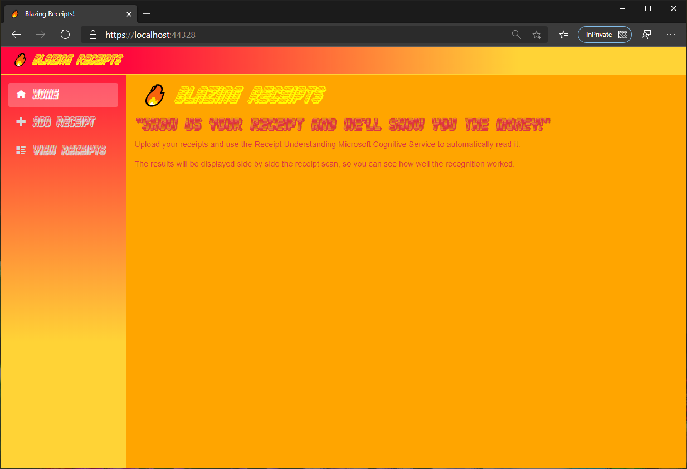
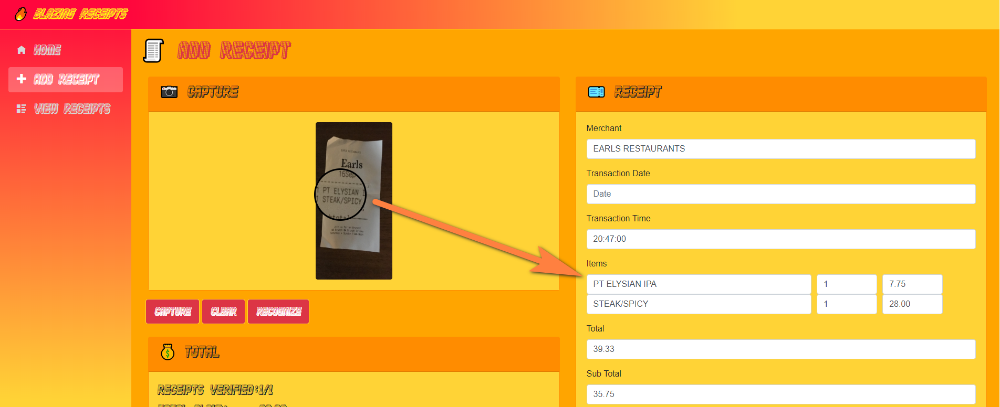
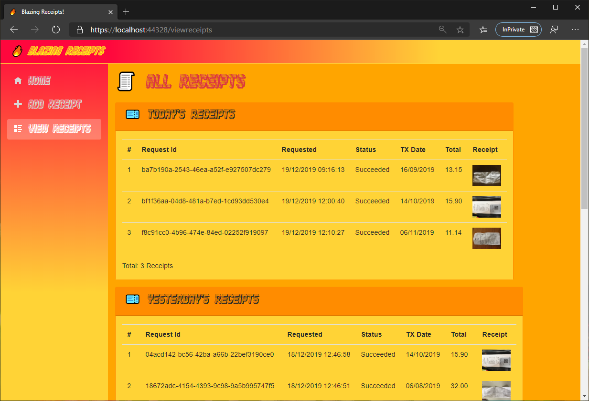

# *🔥 Blazing Receipts*
## A Blazor WebAssembly application for reading receipts

A Blazor WebAssembly application that can read your receipts.  

Using the Receipt Understanding Cognitive Service this web application serves as working PoC (not reference) sample of how you can build your own responsive website that can process multiple documents (receipts).

### Add a new receipt for recognition

### Itemized receipts

### View analyzed receipts

For an end-to-end demo see <a href="docs/demo.mp4">here</a>

## High level overview

* Web App - Uploading receipt photos or images via a web browser
* Web API - Takes file uploads, saves them to Blob Storage and adds the request to a Storage Queue.  Serves up receipt information from previous recognition results.
* Web Worker - Processes requests from the Storage Queue, uses SignalR to send status updates to the end user

## Underlying Components

* [Blazor WebAssembly](https://docs.microsoft.com/en-us/aspnet/core/blazor/hosting-models?view=aspnetcore-3.1#blazor-webassembly)
* [Azure Blob Storage](https://docs.microsoft.com/en-us/azure/storage/blobs/storage-blobs-introduction)
* [Azure Storage Queue](https://docs.microsoft.com/en-us/azure/storage/queues/storage-queues-introduction)
* [ASP.NET Core SignalR](https://docs.microsoft.com/en-us/aspnet/core/tutorials/signalr?view=aspnetcore-3.1&tabs=visual-studio)
* [Forms Recognizer Cognitive Service](https://azure.microsoft.com/en-us/services/cognitive-services/form-recognizer/)

## BlazingReceipts.Client

Blazor WebAssembly app - the UI

## BlazingReceipts.Server

ASP.NET Web API - the Backend API

## BlazingReceipts.Worker

ASP.NET Worker - Does the grunt work

Processes each request - sending to the the Receipt Understanding Cognitive Services, then polls until the service comes back with a result.

Acts a SignalR hub for sending out updates to the end users

## BlazingReceipts.Shared

.NET Standard library that is used across all the components

## BlazorInputFile

A slightly tweaked version of Steve Sanderson's [BlazorInputFile](https://github.com/SteveSandersonMS/BlazorInputFile) that lets you get the selected file's local blob url

## Forms Recognizer - Receipt Understanding Cognitive Service

Computer vision API that can extracts values from scanned receipts.  This project now uses the preview API v2.

## Requirements

#### You'll need the following:

* [Forms Recognizer](https://azure.microsoft.com/en-us/services/cognitive-services/form-recognizer/) subscription key - sign up for this [preview service](https://forms.office.com/Pages/ResponsePage.aspx?id=v4j5cvGGr0GRqy180BHbRyj5DlT4gqZKgEsfbkRQK5xUMjZVRU02S1k4RUdLWjdKUkNRQVRRTDg1NC4u)
* Azure Storage Connection String - set this both within the BlazingReceipts.ReceiptWorker/appsettings.json and the BlazingReceipts.Server/appsettings.json
* Forms Recognizer Endpoint - set this within the BlazingReceipts.ReceiptWorker/appsettings.json
* Forms Recognizer Subscription Key - set this within the BlazingReceipts.ReceiptWorker/appsettings.json

#### To run locally:

Set Multiple Startup Projects for the solution and include:

* BlazingReceipts.Server
* BlazingReceipts.Worker

The default address for the SignalR Hub, within BlazingReceipts.ReceiptWorker/appsettings.json is http://localhost:5000/Hubs/OCRStatusHub

## TODO:

Things to get round to include:

* Add security, currently all receipts are available to all users (not great for production!)
* Use EXIF data (if available) to ascertain if the scan has been taken portrait or landscape mode and display the preview image accordingly
* Use batching to send multiple jobs to Cognitive Service API (currently each receipt is processed one at a time)

## FAQ

* Q: What's that awesome font?
* A: "Diskoteque" by [Jakob Fischer](jakob@pizzadude.dk)
* Q: How do I get access to the underlying Cognitive Service?
* A: Sign up [here](https://forms.office.com/Pages/ResponsePage.aspx?id=v4j5cvGGr0GRqy180BHbRyj5DlT4gqZKgEsfbkRQK5xUMjZVRU02S1k4RUdLWjdKUkNRQVRRTDg1NC4u)
